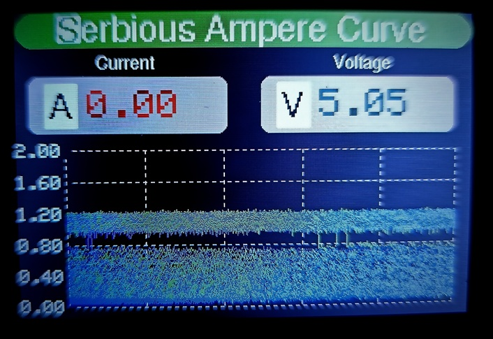

# ⚡ Ampere Curve Grapher (Arduino)

This project displays and graphs the **current (A)** and **voltage (V)** in real time using an Arduino, a **3.5" TFT display**, and an **ACS712 current sensor**.  
It can be used for monitoring power consumption, testing circuits, and visualizing load behavior.  

---

## 🔧 Hardware Used
- **Arduino UNO / MEGA / compatible**
- **3.5" TFT LCD** (MCUFRIEND or ILI9486 driver)
- **ACS712 Current Sensor** (5A, 20A, or 30A version)
- Voltage divider circuit (for safe voltage measurement)
- Jumper wires, breadboard or PCB

---

## 🚀 Features
- Real-time current & voltage measurement
- Graphical plotting of current curve
- Digital readouts for **Amps (A)** and **Volts (V)**
- Auto-scaling Y-axis for better visualization
- Clean UI with labels and curve plotting

---

## 🛠️ Libraries Required
Make sure you install these Arduino libraries:
- [Adafruit GFX](https://github.com/adafruit/Adafruit-GFX-Library)
- [MCUFRIEND_kbv](https://github.com/prenticedavid/MCUFRIEND_kbv)
- [ACS712 Current Sensor](https://github.com/martinhill/ACS712)

---

## 📂 Project Structure
